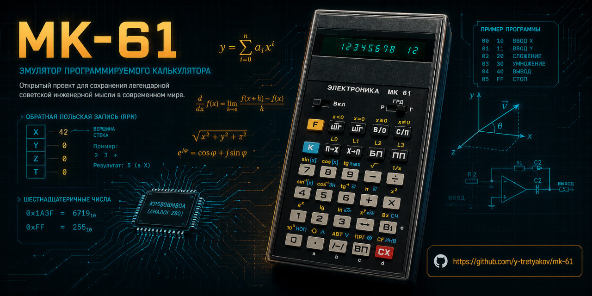

# ⚙️ Электроника МК-61 — Интерактивный Обучающий Симулятор



[](https://github.com/y-tretyakov/mk-61/actions/workflows/deploy.yml)
[](https://vitest.dev)
[](https://react.dev)
[](https://typescriptlang.org)
[](LICENSE)

> **«Живая легенда советской микроэлектроники — теперь у вас в браузере.»**

Представьте 1983 год. Зелёное свечение вакуумно-люминесцентного индикатора, щелчки клавиш и ощущение настоящего советского железа...  
**МК-61** — легендарный программируемый калькулятор, который научил тысячи инженеров RPN и низкоуровневому программированию.

Теперь он полностью эмулирован и доступен в браузере.

> **🌐 [Открыть симулятор](https://y-tretyakov.github.io/mk-61/)**

---

## 🎯 Что эмулировано

- **Полный RPN-стек** (X, Y, Z, T) + регистр X1
- **15 регистров памяти** (0–9, A–E)
- **105 шагов программной памяти** с записью в режиме ПРГ
- Точные F/K-функции, тригонометрия, логи, степени, память, стековые операции
- Реалистичная **VFD-эмуляция** с эффектами свечения
- 12 интерактивных уроков с автодемо и проверкой

**Техстек:** React 19 + TypeScript + Zustand + Vite + Tailwind CSS 4  
**Тесты:** Vitest (unit) + Playwright (E2E)

---

## 🚀 Планируемые нововведения

### Высокий приоритет
- Полноценный интерпретатор программ (С/П, ШГ, БП, ПП, условные переходы, подпрограммы)
- Сохранение и загрузка программ (LocalStorage + экспорт/импорт)
- Исправление и стабилизация всех E2E-тестов (уроки 11–12 + debug-тесты)

### Средний приоритет
- Более точная эмуляция математики и поведения оригинального железа (8-разрядная точность)
- Пошаговое выполнение программ с подсветкой текущей команды
- Библиотека готовых классических программ для МК-61
- Рефакторинг ядра (`handleKey` → отдельная Virtual Machine)

### В перспективе
- Поддержка «синтетических команд» и известных хаков ЕГГОГ
- Экспорт/импорт в форматах, совместимых с другими эмуляторами МК-61/МК-52
- Улучшенная мобильная версия + PWA
- Темы оформления (ретро + современные)
- Расширенная документация по opcode-таблице и различиям с реальным устройством


> 
> Мы открыты к pull request'ам! Особенно приветствуется помощь с полноценной виртуальной машиной и тестами.
>
---

## 🚀 Запуск и разработка

```bash
git clone https://github.com/y-tretyakov/mk-61.git
cd mk-61
npm install
npm run dev          # localhost:5173
```

### Доступные скрипты

| Команда                  | Описание                                      |
|--------------------------|-----------------------------------------------|
| `npm run dev`            | Запуск dev-сервера                            |
| `npm run build`          | Production-сборка                             |
| `npm run preview`        | Просмотр собранного проекта                   |
| `npm run test:unit`      | **Unit-тесты** (Vitest) — 53 теста на VM      |
| `npm run test:headed`    | E2E-тесты Playwright с видимым браузером     |
| `npm test`               | Все тесты (Vitest + Playwright)               |

> **Примечание:** Некоторые debug-тесты и уроки 11–12 могут требовать доработки (таймауты / состояние задачи). Основные unit-тесты проходят стабильно.

### Структура проекта

- `src/store/` — ядро эмулятора (`calculatorStore.ts`)
- `src/vm/` — виртуальная машина и тесты
- `src/data/lessons.ts` — уроки
- `tests/` — E2E-тесты Playwright

---

**С любовью к советской технике и точной эмуляции.**

MIT License • 2026
