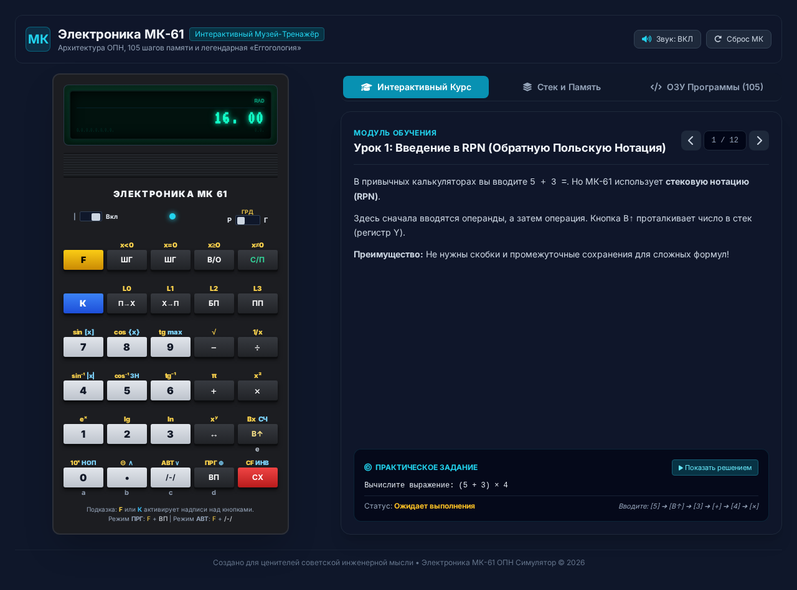

# Электроника МК-61 — Интерактивный Обучающий Симулятор

[](https://github.com/y-tretyakov/mk-61/actions/workflows/deploy.yml)
[](https://playwright.dev)
[](https://react.dev)
[](https://typescriptlang.org)
[](LICENSE)

**Живая легенда советской микроэлектроники — теперь в браузере.**

Точная эмуляция программируемого микрокалькулятора **Электроника МК-61** с интерактивным курсом из 12 уроков. Написан на React 19 + Zustand + Vite + TypeScript + Tailwind CSS 4.

> **🇷🇺 [Открыть симулятор](https://y-tretyakov.github.io/mk-61/)**

---

## Возможности

- **Полная эмуляция МК-61** — все 25 клавиш, 4-уровневый RPN-стек (X, Y, Z, T), 15 регистров памяти (0–9, A–E), 105 шагов программной памяти
- **VFD-дисплей** — зелёное свечение, эффект затемнения сегментов, сканирующие линии
- **Режимы**: АВТ (вычисления), ПРГ (программирование)
- **Углы**: РАД, ГРАД, Д — переключение одним тумблером
- **F/K-модификаторы** — жёлтые (F) и синие (K) функции с визуальной индикацией
- **Встроенный курс** — 12 интерактивных уроков с проверкой результата и автодемонстрацией
- **Монитор стека и памяти** — боковая панель с живым отображением регистров
- **Звук нажатия** — Web Audio API (отключаемый)
- **Реалистичная анимация** нажатия клавиш
- **Адаптивная вёрстка** — работает на телефоне и десктопе

## Скриншот



## Технологии

| Технология | Версия |
|-----------|--------|
| React | 19 |
| Zustand | 5 |
| Vite | 6 |
| TypeScript | ~5.7 |
| Tailwind CSS | 4 |
| Playwright (тесты) | 1.61 |

## Уроки

1. Введение в ОПН — `(5+3)×4`
2. Работа со стеком — обмен, Bx
3. Адресуемая память — запись/чтение
4. Режим программирования
5. ЕГГОГ — обработка ошибок
6. Тригонометрия — sin 30°
7. Логарифмы — lg 100
8. Корни и степени — √25
9. Число π и обратная величина — 1/π
10. K-функции — модуль, знак, дробная/целая часть
11. Регистр Bx — восстановление последнего X
12. Комплексное выражение — `(7+8)×(9-3)`

Каждый урок содержит теоретический материал, практическое задание и кнопку «Показать решение» — автоматический ввод правильной последовательности нажатий со скоростью демонстрации.

## Разработка

```bash
npm install
npm run dev        # dev-сервер на localhost:5173
npm run build      # production-сборка в dist/
npm run preview    # предпросмотр собранного
npm test           # E2E-тесты Playwright (headless)
npm run test:headed  # тесты с браузером
```

## Лицензия

MIT
